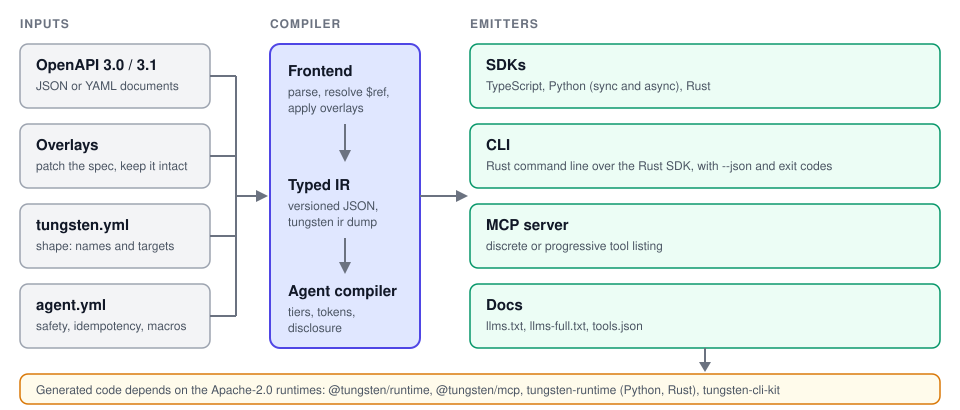

<div align="center">


**Compile an OpenAPI description into SDKs, a CLI and an MCP server that AI agents can use safely.**

[](https://github.com/pboachie/tungsten/actions/workflows/ci.yml)
[](LICENSE)
[](runtimes/LICENSE)
[](Cargo.toml)

</div>

tungsten is a deterministic compiler written in Rust. It reads OpenAPI 3.0 and 3.1 documents plus two small manifests, builds one typed intermediate representation (IR), and emits TypeScript, Python and Rust SDKs, a Rust command-line client, an MCP server and LLM-oriented docs. Every emitted client is built for an autonomous caller: failures are instructions, side effects are never duplicated, and irreversible calls need an explicit confirmation.

## Why tungsten

Most SDK generators optimize for a person reading autocomplete. An agent has a finite context window, no memory between retries, and no sense of what is irreversible. tungsten changes the design goal of each stage:

- **Diagnostic error envelopes.** Every failure, from argument validation to a transport error to an HTTP status, is one closed JSON shape with a category, the failing parameter, the received value, what was expected, a remediation sentence and an explicit `retryable` verdict. The same 14 members in every runtime, ready to paste into a model's context.
- **Safety tiers.** Each operation is `read_only`, `mutating`, `destructive` or `irreversible`, defaulted from the HTTP method and refined in `agent.yml`. Tiers drive retries, MCP tool annotations and confirmation rules.
- **Previews and confirmation tokens.** A destructive or irreversible call must be previewed first. The preview returns the request that would be sent and its effects, plus a confirmation token that is valid only for identical arguments. The generated CLI replaces tokens with `--yes` (and `--i-understand` for irreversible operations).
- **Idempotency and unknown outcomes.** Mutations are retried only with an idempotency key (or an identity body), always with the same key. A timeout or reset after a write is reported as `OUTCOME_UNKNOWN` with the call to verify it, not as a failure to retry blindly.
- **Verification.** An operation can name a read to run after success and the state to expect, attached to the result as evidence.
- **MCP progressive disclosure.** Past a tool-count threshold the server lists a few meta-tools (`search_tools`, `describe_tool`, `invoke`, `preview`, `list_clusters`) instead of every operation. In the maintainers' measurement on the ZROtext pilot (October 2026, BPE token counts), the progressive listing of its 41 tools costs 765 tokens, against 9,473 for the 14 tools of that project's hand-written MCP server.
- **Deterministic output.** The same inputs produce byte-identical files. Generated files record the generator version and the digest of their inputs, and `tungsten generate --check` fails when output is stale.

## Targets

| Target | Emits | Runtime it depends on |
|---|---|---|
| `typescript` | Typed SDK, `Result` values, Zod validation | `@tungsten/runtime` |
| `python` | Sync and async SDK, strict Pydantic v2 models | `tungsten-runtime` (PyPI) |
| `rust` | Async SDK (serde, reqwest) and, optionally, a generated CLI | `tungsten-runtime` and `tungsten-cli-kit` (crates) |
| `mcp` | MCP server over stdio or Streamable HTTP, discrete or progressive | `@tungsten/mcp` |
| `docs` | `llms.txt`, `llms-full.txt`, `tools.json`, README | none |

Targets and the mock server (`tungsten mock`) share one IR, so they agree on operations, types and rules. The three SDK runtimes implement identical semantics: as of this writing a shared contract suite of 58 scenarios (kept in the maintainers' repository) passes unchanged through the TypeScript, Python and Rust drivers.

## Install

From source, with Rust 1.95 or newer (the repository pins 1.97.0 in [`rust-toolchain.toml`](rust-toolchain.toml) for development):

```sh
git clone https://github.com/pboachie/tungsten
cd tungsten
cargo install --path crates/tungsten-cli   # installs the `tungsten` binary
tungsten doctor                            # reports optional tools (node, python3, uv, formatters)
```

Prebuilt releases are coming with 0.1. Node, Python and the formatters are optional: a missing tool only disables the target or `--format` option that needs it.

## Quickstart

```sh
tungsten init --from openapi.json   # writes tungsten.yml and agent.yml
```

`init` writes no targets, so `generate` has nothing to do until you add some. Edit `tungsten.yml` to add targets, and `agent.yml` to review every operation with side effects (init lists them as TODO):

```yaml
# tungsten.yml
targets:
  typescript: { package: "@acme/petstore", out: generated/typescript }
  python:     { package: acme-petstore, module: acme_petstore, out: generated/python }
  docs:       { out: generated/docs }
```

```sh
tungsten check              # validate specs and manifests
tungsten generate           # write every configured target
tungsten mock . --port 8099 # serve the API from the IR, no backend needed
```

Then call the generated SDK. Python (the TypeScript client is symmetrical: `const res = await client.pets.list({ limit: 10 })`):

```python
from acme_petstore import SwaggerPetstoreClient, Ok

client = SwaggerPetstoreClient(base_url="http://127.0.0.1:8099")
res = client.pets.list(limit=10)
if isinstance(res, Ok):
    print(res.value)
else:
    print(res.error["category"], res.error["remediation"])
```

Calls return a `Result` and do not raise for API or transport errors. Arguments are validated before anything is sent, so a wrong type produces this envelope (real output of the snippet above with `limit="ten"`, no request made):

```json
{
  "status": "error",
  "category": "VALIDATION_FAILED",
  "operation": "petstore.listPets",
  "http_status": null,
  "code": null,
  "failed_parameter": "args.limit",
  "received_value": "ten",
  "expected": "Input should be a valid integer",
  "remediation": "Fix args.limit (Input should be a valid integer) and call again.",
  "retryable": "never",
  "retry_after_ms": null,
  "next_action": null,
  "request_id": null,
  "trace": { "attempts": 0 }
}
```

Destructive operations use the preview flow. From the TypeScript SDK generated for the ZROtext pilot:

```ts
const preview = await client.public.webhooks.disable.preview({ endpointId });
if (preview.ok && preview.value.confirmation_token) {
  console.log(preview.value.effects);
  await client.public.webhooks.disable({ endpointId }, { confirm: preview.value.confirmation_token });
}
```

## Architecture

<p align="center"></p>

1. The **frontend** reads OpenAPI 3.0 and 3.1, resolves references and applies overlays.
2. The **IR** is a versioned JSON document (`tungsten ir dump`, schema via `tungsten schema ir`).
3. The **agent compiler** merges `agent.yml` into it: safety tiers, idempotency, confirmation, remediation text, verification hooks, macros and the disclosure mode for MCP.
4. **Emitters** (`crates/tungsten-emit-*`) write each target from the IR. They are pure functions of their inputs.
5. **Runtimes** (`runtimes/`) hold the behaviour shared by generated code: validation, auth, retries, idempotency stores, the envelope, previews, pagination and middleware.

Repository layout: `crates/` is the compiler (AGPL-3.0-only); `runtimes/ts`, `runtimes/mcp`, `runtimes/python` and `runtimes/rust` are the libraries generated code depends on (Apache-2.0).

## CLI

```
tungsten [--json] <command>
```

| Command | Purpose |
|---|---|
| `init` | Write `tungsten.yml` and `agent.yml` for a new project (`--from`, `--dir`, `--name`, `--force`) |
| `check` | Validate the manifests and specs and report diagnostics (`--ci`, `--strict`) |
| `generate` | Generate every configured target (`--target`, `--dry-run`, `--check`, `--force`, `--strict`) |
| `ir dump` | Write the IR as JSON (`--out`, `--compact`) |
| `explain` | Explain a diagnostic code (`TG0201`), an operation or a type |
| `schema` | Print a published JSON Schema: `tungsten`, `agent`, `ir`, `cli-output` |
| `mock` | Serve a mock of the API from the IR (`--port`, `--seed`, `--gate`) |
| `report` | Coverage, safety matrix, token budgets and diagnostics, as text, JSON or one static HTML file (`--html`) |
| `diff` | Show what regeneration would change; `--semver` classifies the API surface change |
| `doctor` | Report which optional external tools are installed |

With `--json`, stdout carries exactly one JSON document described by `tungsten schema cli-output`. Color is used only on a terminal and never when `NO_COLOR` is set.

| Exit code | Meaning |
|---|---|
| 0 | Success (also `diff` when regeneration would change files, and `report` with warnings) |
| 1 | The input has errors (or warnings with `--strict`), generated output is stale (`generate --check`, `check --ci`), or the item asked for does not exist |
| 2 | Usage error: the command line could not be parsed |
| 3 | I/O or internal failure (for example `--out` is not writable) |
| 4 | Refused to act without confirmation (`init` over existing files, `generate` into a directory tungsten did not write: pass `--force`) |

The CLI that tungsten generates for a Rust target has its own exit codes (0 success, 2 usage or pre-flight validation, 3 API error, 4 retryable API error, 5 unknown outcome, 6 confirmation required, 7 missing credentials) so a calling agent can branch on them.

## Project status

tungsten is **pre-0.1**. The compiler, the three SDK targets, the generated CLI, the MCP server, the docs emitter and the mock server exist and are exercised end to end against a real pilot API (ZROtext), including a live run of its scenarios. Nothing is published to a package registry yet: the runtimes are used by path or from source, and prebuilt binaries arrive with 0.1. Expect breaking changes to manifests, the IR and generated code before then. Known limits are tracked in the maintainers' status notes; open an issue if one blocks you.

The test suite, conformance corpus and design documents live in a separate maintainers' repository, which runs against every pull request. This repository is source only.

## Licensing

- The compiler (`crates/`) is licensed under [AGPL-3.0-only](LICENSE).
- The runtime libraries that generated code depends on (`runtimes/`) are licensed under [Apache-2.0](runtimes/LICENSE).
- Output generated by tungsten is not a work covered by the AGPL and carries no licence from tungsten. The owner of the API description chooses the licence of the generated code.

## Contributing and security

Read [CONTRIBUTING.md](CONTRIBUTING.md) before opening a pull request, and open an issue to discuss a large change first. Report vulnerabilities privately as described in [SECURITY.md](SECURITY.md); please do not file them as public issues.
