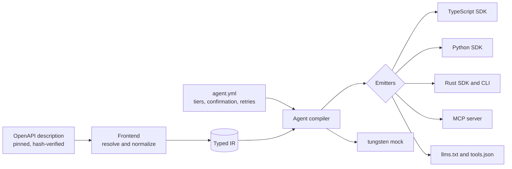

# tungsten on six public APIs

This page shows what [tungsten](../../README.md) does with real, widely used OpenAPI descriptions: what it finds in them, how large an MCP server for each would be to an agent, what the generated SDK code looks like in three languages, and how a destructive operation is treated. Everything is produced by [`run.sh`](run.sh) from descriptions pinned by commit and checked by hash. The numbers below are the script's output, not estimates made by hand.

No request is ever sent to any of these services. The generated clients here are only read, and anything you try yourself goes to [`tungsten mock`](#try-it-against-the-mock), which serves the API from the compiled description.

> The owners of these APIs are not affiliated with, and do not endorse, tungsten or this page. Names are used only to say which public OpenAPI description was processed.



## The six at a glance

<!-- showcase:begin summary -->
Numbers from tungsten 0.1.0.

| API | Operations | Errors / warnings / infos | MCP listing, discrete (tokens) | MCP listing, progressive (tokens) |
|---|---:|---:|---:|---:|
| Stripe | 612 | 0 / 1,626 / 305 | 29,369,721 | 855 |
| GitHub REST | 1,232 | 0 / 404 / 50 | 1,240,738 | 860 |
| Twilio | 197 | 0 / 22 / 309 | 207,004 | 865 |
| OpenAI | 359 | 0 / 195 / 58 | 1,114,418 | 857 |
| Kubernetes (core/v1) | 248 | 0 / 65 / 0 | 2,326,388 | 863 |
| Discord | 246 | 0 / 282 / 7 | 681,029 | 858 |
<!-- showcase:end summary -->

Each row expands below. "Errors / warnings / infos" is what `tungsten check` reports for the description with the manifests in [`apis/`](apis). "MCP listing" is the size of the tool list a server would send to a model: `discrete` lists one tool per operation, `progressive` lists a handful of meta-tools (`search_tools`, `describe_tool`, `invoke`, `preview`, `list_clusters`) that find the operation on demand. Token counts come from tungsten's built-in estimator (`tungsten-estimate-v2`), not from a model's tokenizer: compare them with each other, not with a bill. The discrete figure counts what a server in discrete mode would send for every tool (name, description, input schema, output schema and annotations), so descriptions with large, deeply nested schemas (Stripe's) grow far faster than their operation count.

## One section per API

<!-- showcase:begin api-stripe -->
<details>
<summary><b>Stripe</b> · 612 operations · 0 errors, 1,626 warnings · MCP listing 29,369,721 to 855 tokens</summary>

Payments. The public OpenAPI description. The largest description of the six by schema count (about 9,000 types).

#### What tungsten found

`tungsten check apis/stripe`

```text
tungsten 0.1.0 · stripe · 1 document · 612 operations (612 implemented, 0 planned, 0 gated)
  inputs   ../../.cache/specs/stripe.json (OpenAPI 3.0.0)
  refs     1538 schemas · 2064 edges · 7 cycles (120 recursive) · 0 cross-document
  ir       1 namespace · 233 resources · 612 operations · 9338 types · 2 auth schemes
  result   ok · 0 errors · 1626 warnings
```

Diagnostics of that run, by code:

| Code | Severity | Count | Meaning |
|---|---|---:|---|
| `TG0203` | info | 7 | circular $ref through named types (recursion preserved) |
| `TG0301` | warning | 1,573 | untagged union: runtime will sniff candidates in order |
| `TG0304` | info | 298 | unknown string format treated as plain string |
| `TG0401` | warning | 46 | identifier collision disambiguated |
| `TG0501` | warning | 7 | pagination inferred by heuristic |

Safety tiers assigned to the 612 operations: read-only 273 · mutating 307 · destructive 32 · irreversible 0. Generated files: TypeScript 242, Python 244, Rust 250, docs 4.

#### MCP surface

| | |
|---|---|
| Tools if every operation were listed (discrete) | 29,369,721 tokens |
| Listing in progressive mode | 855 tokens |
| Mode `auto` chose | `progressive` (threshold 24 tools, 612 here) |
| Tools above the 600-token schema budget | 110 |

#### A generated SDK call

`stripe.PostCustomers` in the three generated SDKs (excerpts; `...` marks what is left out).

<details>
<summary>TypeScript</summary>

`typescript/src/resources/customers.ts`

```ts
/**
 * Create a customer
 *
 * ...
 *
 * `POST /v1/customers` (`stripe.PostCustomers`). Safety: `mutating`.
 */
readonly create: ((args?: ops.PostCustomersArgs, opts?: CallOptions) => Promise<Result<$stripe.Customer>>) & {
  readonly descriptor: OperationDescriptor;
  readonly safety: "mutating";
  preview(args?: ops.PostCustomersArgs, opts?: CallOptions): Promise<Result<PreviewResult>>;
};
```

</details>

<details>
<summary>Python</summary>

`python/stripe_sdk/resources/customers.py`

```python
def create(
    self,
    *,
    body: _m_stripe.PostCustomersBody | Unset = UNSET,
    opts: CallOptions | None = None,
) -> Result[_m_stripe.Customer]:
    """Create a customer

    ...

    `POST /v1/customers` (`stripe.PostCustomers`). Safety: `mutating`.

    ...
    """
```

</details>

<details>
<summary>Rust</summary>

`rust/stripe-sdk/src/resources/customers.rs`

```rust
/// Create a customer
///
/// ...
///
/// `POST /v1/customers` (`stripe.PostCustomers`). Safety: `mutating`.
pub async fn create(
    &self,
    request: CustomersCreateRequest,
    opts: &CallOptions,
) -> tungsten_runtime::Result<crate::models::stripe::Customer> {
    // ...
}
```

</details>

#### Agent safety: `stripe.DeleteCustomersCustomer`

The compiled view of one destructive operation, as the docs target writes it for an agent:

```text
### stripe.customers.delete

DELETE /v1/customers/{customer} — Delete a customer [destructive] [idempotency: none]

- Operation: stripe.DeleteCustomersCustomer · tool `stripe_customers_delete`
- Auth: basicAuth | bearerAuth
- Args: { customer: string{..5000}, body?: stripe.DeleteCustomersCustomerBody (application/x-www-form-urlencoded) }
- Returns: 200 stripe.deleted_customer
- Errors: default stripe.error
- Preview: local (validates and renders the request, no network)
- Confirmation: shows customer; "Permanently deletes customer {customer}, cancels their subscriptions and removes their saved payment methods. This cannot be undone."

Delete a customer. <p>Permanently deletes a customer.
```

| Setting | Value | Comes from |
|---|---|---|
| Safety tier | `destructive` | this operation's entry in agent.yml |
| Confirmation | `required (summary: customer)` | this operation's entry in agent.yml |
| Preview | `local` | the defaults in agent.yml |
| Idempotency | `none` | the defaults in agent.yml |
| Verification | `none` | tungsten's built-in default |

The same operation in the three SDKs. Each SDK documents how to confirm: pass a confirmation, or the token that `preview` returns together with the request and its effects.

<details>
<summary>TypeScript</summary>

`typescript/src/resources/customers.ts`

```ts
/**
 * Delete a customer
 *
 * ...
 *
 * `DELETE /v1/customers/{customer}` (`stripe.DeleteCustomersCustomer`). Safety: `destructive`.
 *
 * Requires confirmation: pass `{ confirm: true }`, or the `confirmation_token` of `.preview()` as `confirm`.
 */
readonly delete: ((args: ops.DeleteCustomersCustomerArgs, opts?: CallOptions) => Promise<Result<$stripe.DeletedCustomer>>) & {
  readonly descriptor: OperationDescriptor;
  readonly safety: "destructive";
  preview(args: ops.DeleteCustomersCustomerArgs, opts?: CallOptions): Promise<Result<PreviewResult>>;
};
```

</details>

<details>
<summary>Python</summary>

`python/stripe_sdk/resources/customers.py`

```python
def delete(
    self,
    *,
    customer: str,
    body: _m_stripe.DeleteCustomersCustomerBody | Unset = UNSET,
    opts: CallOptions | None = None,
) -> Result[_m_stripe.DeletedCustomer]:
    """Delete a customer

    ...

    `DELETE /v1/customers/{customer}` (`stripe.DeleteCustomersCustomer`). Safety: `destructive`.

    Requires confirmation: pass `opts={"confirm": True}`, or the `confirmation_token` of `preview_delete()` as `confirm`.

    ...
    """
```

</details>

<details>
<summary>Rust</summary>

`rust/stripe-sdk/src/resources/customers.rs`

```rust
/// Delete a customer
///
/// ...
///
/// `DELETE /v1/customers/{customer}` (`stripe.DeleteCustomersCustomer`). Safety: `destructive`.
///
/// Requires confirmation: pass `confirm: Some(Confirm::Yes)` in the call options, or the `confirmation_token` of `preview_delete()` as `Confirm::Token`.
pub async fn delete(
    &self,
    request: CustomersDeleteRequest,
    opts: &CallOptions,
) -> tungsten_runtime::Result<crate::models::stripe::DeletedCustomer> {
    // ...
}
```

</details>

#### Reproduce

```sh
./run.sh --only stripe
tungsten mock apis/stripe --port 8099
```

</details>
<!-- showcase:end api-stripe -->

<!-- showcase:begin api-github -->
<details>
<summary><b>GitHub REST</b> · 1,232 operations · 0 errors, 404 warnings · MCP listing 1,240,738 to 860 tokens</summary>

Repositories, issues, pull requests, organizations. The api.github.com description. The largest by operation count. Operation ids are GitHub's own (`repos/delete`).

#### What tungsten found

`tungsten check apis/github`

```text
tungsten 0.1.0 · github · 1 document · 1232 operations (1232 implemented, 0 planned, 0 gated)
  inputs   ../../.cache/specs/github.json (OpenAPI 3.0.3)
  refs     994 schemas · 2591 edges · 0 cycles (0 recursive) · 0 cross-document
  ir       1 namespace · 680 resources · 1232 operations · 2724 types · 0 auth schemes
  result   ok · 0 errors · 404 warnings
```

Diagnostics of that run, by code:

| Code | Severity | Count | Meaning |
|---|---|---:|---|
| `TG0301` | warning | 101 | untagged union: runtime will sniff candidates in order |
| `TG0302` | warning | 15 | allOf members conflict and could not be flattened |
| `TG0304` | info | 49 | unknown string format treated as plain string |
| `TG0306` | warning | 1 | discriminator could not be applied as written |
| `TG0401` | warning | 25 | identifier collision disambiguated |
| `TG0501` | warning | 262 | pagination inferred by heuristic |
| `TG0760` | info | 1 | types no operation reaches were not generated (types.prune_unreferenced) |

Safety tiers assigned to the 1,232 operations: read-only 644 · mutating 400 · destructive 188 · irreversible 0. Generated files: TypeScript 689, Python 691, Rust 697, docs 4.

#### MCP surface

| | |
|---|---|
| Tools if every operation were listed (discrete) | 1,240,738 tokens |
| Listing in progressive mode | 860 tokens |
| Mode `auto` chose | `progressive` (threshold 24 tools, 1,232 here) |
| Tools above the 600-token schema budget | 38 |

#### A generated SDK call

`github.issues/create` in the three generated SDKs (excerpts; `...` marks what is left out).

<details>
<summary>TypeScript</summary>

`typescript/src/resources/repos/issues.ts`

```ts
/**
 * Create an issue
 *
 * ...
 *
 * `POST /repos/{owner}/{repo}/issues` (`github.issues/create`). Safety: `mutating`.
 */
readonly create: ((args: ops.IssuesCreateArgs, opts?: CallOptions) => Promise<Result<$github.Issue>>) & {
  readonly descriptor: OperationDescriptor;
  readonly safety: "mutating";
  preview(args: ops.IssuesCreateArgs, opts?: CallOptions): Promise<Result<PreviewResult>>;
};
```

</details>

<details>
<summary>Python</summary>

`python/github_sdk/resources/repos_issues.py`

```python
def create(
    self,
    *,
    owner: str,
    repo: str,
    title: _m_github.IssuesCreateBodyTitle,
    body: str | Unset = UNSET,
    assignee: str | Unset | None = UNSET,
    milestone: _m_github.IssuesCreateBodyMilestone | Unset | None = UNSET,
    labels: list[_m_github.IssuesCreateBodyLabelsItem] | Unset = UNSET,
    assignees: list[str] | Unset = UNSET,
    issue_field_values: list[_m_github.IssuesCreateBodyIssueFieldValuesItem] | Unset = UNSET,
    type_: str | Unset | None = UNSET,
    parent_issue_id: int | Unset = UNSET,
    opts: CallOptions | None = None,
) -> Result[_m_github.Issue]:
    """Create an issue

    ...

    `POST /repos/{owner}/{repo}/issues` (`github.issues/create`). Safety: `mutating`.

    ...
    """
```

</details>

<details>
<summary>Rust</summary>

`rust/github-sdk/src/resources/repos_issues.rs`

```rust
/// Create an issue
///
/// ...
///
/// `POST /repos/{owner}/{repo}/issues` (`github.issues/create`). Safety: `mutating`.
pub async fn create(
    &self,
    request: ReposIssuesCreateRequest,
    opts: &CallOptions,
) -> tungsten_runtime::Result<crate::models::github::Issue2> {
    // ...
}
```

</details>

#### Agent safety: `github.repos/delete`

The compiled view of one destructive operation, as the docs target writes it for an agent:

```text
### github.repos.repos_delete

DELETE /repos/{owner}/{repo} — Delete a repository [destructive] [idempotency: none]

- Operation: github.repos/delete · tool `github_repos_repos_delete`
- Auth: none
- Args: { owner: string, repo: string }
- Returns: 204 (no body), 307 github.basic-error
- Errors: 403 github.ReposDelete403Response, 404 github.basic-error, 409 github.basic-error
- Preview: local (validates and renders the request, no network)
- Confirmation: shows owner, repo; "Deletes repository {owner}/{repo} with its issues, pull requests and wiki. Restoring is possible only for a limited time and only by an organization owner."

Delete a repository. Deleting a repository requires admin access.
```

| Setting | Value | Comes from |
|---|---|---|
| Safety tier | `destructive` | this operation's entry in agent.yml |
| Confirmation | `required (summary: owner, repo)` | this operation's entry in agent.yml |
| Preview | `local` | the defaults in agent.yml |
| Idempotency | `none` | the defaults in agent.yml |
| Verification | `none` | tungsten's built-in default |

The same operation in the three SDKs. Each SDK documents how to confirm: pass a confirmation, or the token that `preview` returns together with the request and its effects.

<details>
<summary>TypeScript</summary>

`typescript/src/resources/repos.ts`

```ts
/**
 * Delete a repository
 *
 * ...
 *
 * `DELETE /repos/{owner}/{repo}` (`github.repos/delete`). Safety: `destructive`.
 *
 * Requires confirmation: pass `{ confirm: true }`, or the `confirmation_token` of `.preview()` as `confirm`.
 *
 * ...
 */
readonly reposDelete: ((args: ops.ReposDeleteArgs, opts?: CallOptions) => Promise<Result<$github.BasicError | undefined>>) & {
  readonly descriptor: OperationDescriptor;
  readonly safety: "destructive";
  preview(args: ops.ReposDeleteArgs, opts?: CallOptions): Promise<Result<PreviewResult>>;
};
```

</details>

<details>
<summary>Python</summary>

`python/github_sdk/resources/repos.py`

```python
def repos_delete(
    self,
    *,
    owner: str,
    repo: str,
    opts: CallOptions | None = None,
) -> Result[_m_github.BasicError | None]:
    """Delete a repository

    ...

    `DELETE /repos/{owner}/{repo}` (`github.repos/delete`). Safety: `destructive`.

    Requires confirmation: pass `opts={"confirm": True}`, or the `confirmation_token` of `preview_repos_delete()` as `confirm`.

    ...
    """
```

</details>

<details>
<summary>Rust</summary>

`rust/github-sdk/src/resources/repos.rs`

```rust
/// Delete a repository
///
/// ...
///
/// `DELETE /repos/{owner}/{repo}` (`github.repos/delete`). Safety: `destructive`.
///
/// Requires confirmation: pass `confirm: Some(Confirm::Yes)` in the call options, or the `confirmation_token` of `preview_repos_delete()` as `Confirm::Token`.
///
/// ...
pub async fn repos_delete(
    &self,
    request: ReposReposDeleteRequest,
    opts: &CallOptions,
) -> tungsten_runtime::Result<Option<crate::models::github::BasicError>> {
    // ...
}
```

</details>

#### Reproduce

```sh
./run.sh --only github
tungsten mock apis/github --port 8099
```

</details>
<!-- showcase:end api-github -->

<!-- showcase:begin api-twilio -->
<details>
<summary><b>Twilio</b> · 197 operations · 0 errors, 22 warnings · MCP listing 207,004 to 865 tokens</summary>

Messaging and voice. The core Api v2010 description (Twilio publishes one file per product). Form-encoded request bodies.

#### What tungsten found

`tungsten check apis/twilio`

```text
tungsten 0.1.0 · twilio · 1 document · 197 operations (197 implemented, 0 planned, 0 gated)
  inputs   ../../.cache/specs/twilio.json (OpenAPI 3.0.1)
  refs     150 schemas · 43 edges · 0 cycles (0 recursive) · 0 cross-document
  ir       1 namespace · 116 resources · 197 operations · 388 types · 1 auth scheme
  result   ok · 0 errors · 22 warnings
```

Diagnostics of that run, by code:

| Code | Severity | Count | Meaning |
|---|---|---:|---|
| `TG0304` | info | 308 | unknown string format treated as plain string |
| `TG0401` | warning | 22 | identifier collision disambiguated |
| `TG0760` | info | 1 | types no operation reaches were not generated (types.prune_unreferenced) |

Safety tiers assigned to the 197 operations: read-only 103 · mutating 62 · destructive 32 · irreversible 0. Generated files: TypeScript 125, Python 127, Rust 133, docs 4.

#### MCP surface

| | |
|---|---|
| Tools if every operation were listed (discrete) | 207,004 tokens |
| Listing in progressive mode | 865 tokens |
| Mode `auto` chose | `progressive` (threshold 24 tools, 197 here) |
| Tools above the 600-token schema budget | 25 |

#### A generated SDK call

`twilio.CreateMessage` in the three generated SDKs (excerpts; `...` marks what is left out).

<details>
<summary>TypeScript</summary>

`typescript/src/resources/2010-04-01/accounts/messages-json.ts`

```ts
/**
 * Send a message
 *
 * `POST /2010-04-01/Accounts/{AccountSid}/Messages.json` (`twilio.CreateMessage`). Safety: `mutating`.
 */
readonly create: ((args: ops.CreateMessageArgs, opts?: CallOptions) => Promise<Result<$twilio.ApiV2010AccountMessage>>) & {
  readonly descriptor: OperationDescriptor;
  readonly safety: "mutating";
  preview(args: ops.CreateMessageArgs, opts?: CallOptions): Promise<Result<PreviewResult>>;
};
```

</details>

<details>
<summary>Python</summary>

`python/twilio_sdk/resources/resource_2010_04_01_accounts_messages_json.py`

```python
def create(
    self,
    *,
    account_sid: str,
    body: _m_twilio.CreateMessageBody | Unset = UNSET,
    opts: CallOptions | None = None,
) -> Result[_m_twilio.ApiV2010AccountMessage]:
    """Send a message

    `POST /2010-04-01/Accounts/{AccountSid}/Messages.json` (`twilio.CreateMessage`). Safety: `mutating`.

    ...
    """
```

</details>

<details>
<summary>Rust</summary>

`rust/twilio-sdk/src/resources/2010_04_01_accounts_messages_json.rs`

```rust
/// Send a message
///
/// `POST /2010-04-01/Accounts/{AccountSid}/Messages.json` (`twilio.CreateMessage`). Safety: `mutating`.
pub async fn create(
    &self,
    request: _2010_04_01AccountsMessagesJsonCreateRequest,
    opts: &CallOptions,
) -> tungsten_runtime::Result<crate::models::twilio::ApiV2010AccountMessage> {
    // ...
}
```

</details>

#### Agent safety: `twilio.DeleteIncomingPhoneNumber`

The compiled view of one destructive operation, as the docs target writes it for an agent:

```text
### twilio.2010_04_01.accounts.incoming_phone_numbers.delete

DELETE /2010-04-01/Accounts/{AccountSid}/IncomingPhoneNumbers/{Sid}.json — Delete a phone-numbers belonging to the account used to make the request. [destructive] [idempotency: none]

- Operation: twilio.DeleteIncomingPhoneNumber · tool `twilio_2010_04_01_accounts_incoming_phone_numbers_delete`
- Auth: accountSid_authToken
- Args: { accountSid: string{34..34} /^AC[0-9a-fA-F]{32}$/, sid: string{34..34} /^PN[0-9a-fA-F]{32}$/ }
- Returns: 204 (no body)
- Preview: local (validates and renders the request, no network)
- Confirmation: shows AccountSid, Sid; "Releases phone number {Sid} of account {AccountSid}. The number returns to the pool and may not be recoverable."
```

| Setting | Value | Comes from |
|---|---|---|
| Safety tier | `destructive` | this operation's entry in agent.yml |
| Confirmation | `required (summary: AccountSid, Sid)` | this operation's entry in agent.yml |
| Preview | `local` | the defaults in agent.yml |
| Idempotency | `none` | the defaults in agent.yml |
| Verification | `none` | tungsten's built-in default |

The same operation in the three SDKs. Each SDK documents how to confirm: pass a confirmation, or the token that `preview` returns together with the request and its effects.

<details>
<summary>TypeScript</summary>

`typescript/src/resources/2010-04-01/accounts/incoming-phone-numbers.ts`

```ts
/**
 * Delete a phone-numbers belonging to the account used to make the request.
 *
 * `DELETE /2010-04-01/Accounts/{AccountSid}/IncomingPhoneNumbers/{Sid}.json` (`twilio.DeleteIncomingPhoneNumber`). Safety: `destructive`.
 *
 * Requires confirmation: pass `{ confirm: true }`, or the `confirmation_token` of `.preview()` as `confirm`.
 *
 * ...
 */
readonly delete: ((args: ops.DeleteIncomingPhoneNumberArgs, opts?: CallOptions) => Promise<Result<void>>) & {
  readonly descriptor: OperationDescriptor;
  readonly safety: "destructive";
  preview(args: ops.DeleteIncomingPhoneNumberArgs, opts?: CallOptions): Promise<Result<PreviewResult>>;
};
```

</details>

<details>
<summary>Python</summary>

`python/twilio_sdk/resources/resource_2010_04_01_accounts_incoming_phone_numbers.py`

```python
def delete(self, *, account_sid: str, sid: str, opts: CallOptions | None = None) -> Result[None]:
    """Delete a phone-numbers belonging to the account used to make the request.

    `DELETE /2010-04-01/Accounts/{AccountSid}/IncomingPhoneNumbers/{Sid}.json` (`twilio.DeleteIncomingPhoneNumber`). Safety: `destructive`.

    Requires confirmation: pass `opts={"confirm": True}`, or the `confirmation_token` of `preview_delete()` as `confirm`.

    ...
    """
```

</details>

<details>
<summary>Rust</summary>

`rust/twilio-sdk/src/resources/2010_04_01_accounts_incoming_phone_numbers.rs`

```rust
/// Delete a phone-numbers belonging to the account used to make the request.
///
/// `DELETE /2010-04-01/Accounts/{AccountSid}/IncomingPhoneNumbers/{Sid}.json` (`twilio.DeleteIncomingPhoneNumber`). Safety: `destructive`.
///
/// Requires confirmation: pass `confirm: Some(Confirm::Yes)` in the call options, or the `confirmation_token` of `preview_delete()` as `Confirm::Token`.
///
/// ...
pub async fn delete(
    &self,
    request: _2010_04_01AccountsIncomingPhoneNumbersDeleteRequest,
    opts: &CallOptions,
) -> tungsten_runtime::Result<()> {
    // ...
}
```

</details>

#### Reproduce

```sh
./run.sh --only twilio
tungsten mock apis/twilio --port 8099
```

</details>
<!-- showcase:end api-twilio -->

<!-- showcase:begin api-openai -->
<details>
<summary><b>OpenAI</b> · 359 operations · 0 errors, 195 warnings · MCP listing 1,114,418 to 857 tokens</summary>

Models, assistants, files, batches. The published OpenAPI 3.1 description (YAML). OpenAPI 3.1 with streaming responses.

#### What tungsten found

`tungsten check apis/openai`

```text
tungsten 0.1.0 · openai · 1 document · 359 operations (359 implemented, 0 planned, 0 gated)
  inputs   ../../.cache/specs/openai.yaml (OpenAPI 3.1.0)
  refs     2048 schemas · 3019 edges · 2 cycles (2 recursive) · 0 cross-document
  ir       1 namespace · 153 resources · 359 operations · 2690 types · 2 auth schemes
  result   ok · 0 errors · 195 warnings
```

Diagnostics of that run, by code:

| Code | Severity | Count | Meaning |
|---|---|---:|---|
| `TG0111` | info | 6 | path key carries a query string; its pairs are sent on every call |
| `TG0203` | info | 2 | circular $ref through named types (recursion preserved) |
| `TG0301` | warning | 151 | untagged union: runtime will sniff candidates in order |
| `TG0302` | warning | 19 | allOf members conflict and could not be flattened |
| `TG0303` | info | 42 | unsupported or unknown schema keyword ignored |
| `TG0305` | info | 7 | schema type could not be determined; treated as any |
| `TG0401` | warning | 13 | identifier collision disambiguated |
| `TG0501` | warning | 12 | pagination inferred by heuristic |
| `TG0760` | info | 1 | types no operation reaches were not generated (types.prune_unreferenced) |

Safety tiers assigned to the 359 operations: read-only 159 · mutating 149 · destructive 51 · irreversible 0. Generated files: TypeScript 162, Python 164, Rust 170, docs 4.

#### MCP surface

| | |
|---|---|
| Tools if every operation were listed (discrete) | 1,114,418 tokens |
| Listing in progressive mode | 857 tokens |
| Mode `auto` chose | `progressive` (threshold 24 tools, 359 here) |
| Tools above the 600-token schema budget | 47 |

#### A generated SDK call

`openai.createChatCompletion` in the three generated SDKs (excerpts; `...` marks what is left out).

<details>
<summary>TypeScript</summary>

`typescript/src/resources/chat/completions.ts`

```ts
/**
 * Create chat completion
 *
 * ...
 *
 * `POST /chat/completions` (`openai.createChatCompletion`). Safety: `mutating`.
 */
readonly create: ((args: ops.CreateChatCompletionArgs, opts?: CallOptions) => Promise<Result<$openai.CreateChatCompletionResponse>>) & {
  readonly descriptor: OperationDescriptor;
  readonly safety: "mutating";
  preview(args: ops.CreateChatCompletionArgs, opts?: CallOptions): Promise<Result<PreviewResult>>;
};
```

</details>

<details>
<summary>Python</summary>

`python/openai_sdk/resources/chat_completions.py`

```python
def create(
    self,
    *,
    metadata: _m_openai.Metadata | Unset | None = UNSET,
    top_logprobs: int | Unset = UNSET,
    temperature: float | Unset | None = UNSET,
    top_p: float | Unset | None = UNSET,
    user: str | Unset | None = UNSET,
    safety_identifier: str | Unset | None = UNSET,
    prompt_cache_key: str | Unset | None = UNSET,
    prompt_cache_retention: _m_openai.ModelResponsePropertiesPromptCacheRetention | Unset | None = UNSET,
    prompt_cache_options: _m_openai.PromptCacheOptionsParam | Unset = UNSET,
    messages: list[_m_openai.ChatCompletionRequestMessage],
    model: _m_openai.ModelIdsShared,
    service_tier: _m_openai.ServiceTier | Unset | None = UNSET,
    modalities: _m_openai.ResponseModalities | Unset | None = UNSET,
    verbosity: _m_openai.Verbosity | Unset | None = UNSET,
    reasoning_effort: _m_openai.ReasoningEffort | Unset | None = UNSET,
    max_completion_tokens: int | Unset | None = UNSET,
    frequency_penalty: float | Unset | None = UNSET,
    presence_penalty: float | Unset | None = UNSET,
    web_search_options: _m_openai.CreateChatCompletionRequestWebSearchOptions | Unset = UNSET,
    response_format: _m_openai.CreateChatCompletionRequestResponseFormat | Unset = UNSET,
    audio: _m_openai.CreateChatCompletionRequestAudio | Unset | None = UNSET,
    store: bool | Unset | None = UNSET,
    moderation: _m_openai.ModerationParam | Unset | None = UNSET,
    stream: bool | Unset | None = UNSET,
    stop: _m_openai.StopConfiguration | Unset | None = UNSET,
    logit_bias: dict[str, int] | Unset | None = UNSET,
    logprobs: bool | Unset | None = UNSET,
    max_tokens: int | Unset | None = UNSET,
    n: int | Unset | None = UNSET,
    prediction: _m_openai.PredictionContent | Unset | None = UNSET,
    seed: int | Unset | None = UNSET,
    stream_options: _m_openai.ChatCompletionStreamOptions | Unset | None = UNSET,
    tools: list[_m_openai.CreateChatCompletionRequestToolsItem] | Unset = UNSET,
    tool_choice: _m_openai.ChatCompletionToolChoiceOption | Unset = UNSET,
    parallel_tool_calls: _m_openai.ParallelToolCalls | Unset = UNSET,
    function_call: _m_openai.CreateChatCompletionRequestFunctionCall | Unset = UNSET,
    functions: list[_m_openai.ChatCompletionFunctions] | Unset = UNSET,
```

</details>

<details>
<summary>Rust</summary>

`rust/openai-sdk/src/resources/chat_completions.rs`

```rust
/// Create chat completion
///
/// ...
///
/// `POST /chat/completions` (`openai.createChatCompletion`). Safety: `mutating`.
///
/// ...
pub async fn create(
    &self,
    request: ChatCompletionsCreateRequest,
    opts: &CallOptions,
) -> tungsten_runtime::Result<crate::models::openai::CreateChatCompletionResponse> {
    // ...
}
```

</details>

#### Agent safety: `openai.deleteAssistant`

The compiled view of one destructive operation, as the docs target writes it for an agent:

```text
### openai.assistants.delete

DELETE /assistants/{assistant_id} — Delete assistant [destructive] [idempotency: none] [deprecated]

- Operation: openai.deleteAssistant · tool `openai_assistants_delete`
- Auth: ApiKeyAuth
- Args: { assistantId: string }
- Returns: 200 openai.DeleteAssistantResponse
- Errors: 429 openai.ErrorResponse
- Preview: local (validates and renders the request, no network)
- Confirmation: shows assistant_id; "Deletes assistant {assistant_id}. Threads that reference it can no longer run."

Delete assistant. Delete an assistant.
```

| Setting | Value | Comes from |
|---|---|---|
| Safety tier | `destructive` | this operation's entry in agent.yml |
| Confirmation | `required (summary: assistant_id)` | this operation's entry in agent.yml |
| Preview | `local` | the defaults in agent.yml |
| Idempotency | `none` | the defaults in agent.yml |
| Verification | `none` | tungsten's built-in default |

The same operation in the three SDKs. Each SDK documents how to confirm: pass a confirmation, or the token that `preview` returns together with the request and its effects.

<details>
<summary>TypeScript</summary>

`typescript/src/resources/assistants.ts`

```ts
/**
 * Delete assistant
 *
 * ...
 *
 * `DELETE /assistants/{assistant_id}` (`openai.deleteAssistant`). Safety: `destructive`.
 *
 * Requires confirmation: pass `{ confirm: true }`, or the `confirmation_token` of `.preview()` as `confirm`.
 *
 * ...
 */
readonly delete: ((args: ops.DeleteAssistantArgs, opts?: CallOptions) => Promise<Result<$openai.DeleteAssistantResponse>>) & {
  readonly descriptor: OperationDescriptor;
  readonly safety: "destructive";
  preview(args: ops.DeleteAssistantArgs, opts?: CallOptions): Promise<Result<PreviewResult>>;
};
```

</details>

<details>
<summary>Python</summary>

`python/openai_sdk/resources/assistants.py`

```python
def delete(
    self,
    *,
    assistant_id: str,
    opts: CallOptions | None = None,
) -> Result[_m_openai.DeleteAssistantResponse]:
    """Delete assistant

    ...

    `DELETE /assistants/{assistant_id}` (`openai.deleteAssistant`). Safety: `destructive`.

    Requires confirmation: pass `opts={"confirm": True}`, or the `confirmation_token` of `preview_delete()` as `confirm`.

    ...
    """
```

</details>

<details>
<summary>Rust</summary>

`rust/openai-sdk/src/resources/assistants.rs`

```rust
/// Delete assistant
///
/// ...
///
/// `DELETE /assistants/{assistant_id}` (`openai.deleteAssistant`). Safety: `destructive`.
///
/// Requires confirmation: pass `confirm: Some(Confirm::Yes)` in the call options, or the `confirmation_token` of `preview_delete()` as `Confirm::Token`.
///
/// ...
pub async fn delete(
    &self,
    request: AssistantsDeleteRequest,
    opts: &CallOptions,
) -> tungsten_runtime::Result<crate::models::openai::DeleteAssistantResponse> {
    // ...
}
```

</details>

#### Reproduce

```sh
./run.sh --only openai
tungsten mock apis/openai --port 8099
```

</details>
<!-- showcase:end api-openai -->

<!-- showcase:begin api-kubernetes -->
<details>
<summary><b>Kubernetes (core/v1)</b> · 248 operations · 0 errors, 65 warnings · MCP listing 2,326,388 to 863 tokens</summary>

Pods, services, namespaces. The OpenAPI v3 description of the core/v1 group at release v1.37.1. One API group of many; the cluster-wide aggregated description is far larger.

#### What tungsten found

`tungsten check apis/kubernetes`

```text
tungsten 0.1.0 · kubernetes · 1 document · 248 operations (248 implemented, 0 planned, 0 gated)
  inputs   ../../.cache/specs/kubernetes.json (OpenAPI 3.0.0)
  refs     258 schemas · 375 edges · 0 cycles (0 recursive) · 0 cross-document
  ir       1 namespace · 78 resources · 248 operations · 258 types · 1 auth scheme
  result   ok · 0 errors · 65 warnings
```

Diagnostics of that run, by code:

| Code | Severity | Count | Meaning |
|---|---|---:|---|
| `TG0401` | warning | 65 | identifier collision disambiguated |

Safety tiers assigned to the 248 operations: read-only 120 · mutating 93 · destructive 35 · irreversible 0. Generated files: TypeScript 87, Python 89, Rust 95, docs 4.

#### MCP surface

| | |
|---|---|
| Tools if every operation were listed (discrete) | 2,326,388 tokens |
| Listing in progressive mode | 863 tokens |
| Mode `auto` chose | `progressive` (threshold 24 tools, 248 here) |
| Tools above the 600-token schema budget | 145 |

#### A generated SDK call

`kubernetes.createCoreV1NamespacedPod` in the three generated SDKs (excerpts; `...` marks what is left out).

<details>
<summary>TypeScript</summary>

`typescript/src/resources/api/v1/namespaces/pods.ts`

```ts
/**
 * create a Pod
 *
 * `POST /api/v1/namespaces/{namespace}/pods` (`kubernetes.createCoreV1NamespacedPod`). Safety: `mutating`.
 */
readonly create: ((args: ops.CreateCoreV1NamespacedPodArgs, opts?: CallOptions) => Promise<Result<$kubernetes.IoK8SApiCoreV1Pod>>) & {
  readonly descriptor: OperationDescriptor;
  readonly safety: "mutating";
  preview(args: ops.CreateCoreV1NamespacedPodArgs, opts?: CallOptions): Promise<Result<PreviewResult>>;
};
```

</details>

<details>
<summary>Python</summary>

`python/kubernetes_sdk/resources/api_v1_namespaces_pods.py`

```python
def create(
    self,
    *,
    namespace: str,
    pretty: str | Unset = UNSET,
    dry_run: str | Unset = UNSET,
    field_manager: str | Unset = UNSET,
    field_validation: str | Unset = UNSET,
    api_version: str | Unset = UNSET,
    kind: str | Unset = UNSET,
    metadata: _m_kubernetes.IoK8SApimachineryPkgApisMetaV1ObjectMeta | Unset = UNSET,
    spec: _m_kubernetes.IoK8SApiCoreV1PodSpec | Unset = UNSET,
    status: _m_kubernetes.IoK8SApiCoreV1PodStatus | Unset = UNSET,
    opts: CallOptions | None = None,
) -> Result[_m_kubernetes.IoK8SApiCoreV1Pod]:
    """create a Pod

    `POST /api/v1/namespaces/{namespace}/pods` (`kubernetes.createCoreV1NamespacedPod`). Safety: `mutating`.

    ...
    """
```

</details>

<details>
<summary>Rust</summary>

`rust/kubernetes-sdk/src/resources/api_v1_namespaces_pods.rs`

```rust
/// create a Pod
///
/// `POST /api/v1/namespaces/{namespace}/pods` (`kubernetes.createCoreV1NamespacedPod`). Safety: `mutating`.
pub async fn create(
    &self,
    request: ApiV1NamespacesPodsCreateRequest,
    opts: &CallOptions,
) -> tungsten_runtime::Result<crate::models::kubernetes::IoK8SApiCoreV1Pod> {
    // ...
}
```

</details>

#### Agent safety: `kubernetes.deleteCoreV1NamespacedPod`

The compiled view of one destructive operation, as the docs target writes it for an agent:

```text
### kubernetes.api.v1.namespaces.pods.delete

DELETE /api/v1/namespaces/{namespace}/pods/{name} — delete a Pod [destructive] [idempotency: none]

- Operation: kubernetes.deleteCoreV1NamespacedPod · tool `kubernetes_api_v1_namespaces_pods_delete`
- Auth: none
- Args: { namespace: string, name: string, pretty?: string, dryRun?: string, gracePeriodSeconds?: integer, ignoreStoreReadErrorWithClusterBreakingPotential?: boolean, orphanDependents?: boolean, propagationPolicy?: s ...
- Returns: 200 application/cbor, 202 application/cbor
- Errors: 401 (no body)
- Preview: local (validates and renders the request, no network)
- Confirmation: shows namespace, name; "Deletes pod {name} in namespace {namespace}. Containers are terminated; a controller may recreate the pod."

delete a Pod.
```

| Setting | Value | Comes from |
|---|---|---|
| Safety tier | `destructive` | this operation's entry in agent.yml |
| Confirmation | `required (summary: namespace, name)` | this operation's entry in agent.yml |
| Preview | `local` | the defaults in agent.yml |
| Idempotency | `none` | the defaults in agent.yml |
| Verification | `none` | tungsten's built-in default |

The same operation in the three SDKs. Each SDK documents how to confirm: pass a confirmation, or the token that `preview` returns together with the request and its effects.

<details>
<summary>TypeScript</summary>

`typescript/src/resources/api/v1/namespaces/pods.ts`

```ts
/**
 * delete a Pod
 *
 * `DELETE /api/v1/namespaces/{namespace}/pods/{name}` (`kubernetes.deleteCoreV1NamespacedPod`). Safety: `destructive`.
 *
 * Requires confirmation: pass `{ confirm: true }`, or the `confirmation_token` of `.preview()` as `confirm`.
 */
readonly delete: ((args: ops.DeleteCoreV1NamespacedPodArgs, opts?: CallOptions) => Promise<Result<$kubernetes.IoK8SApiCoreV1Pod>>) & {
  readonly descriptor: OperationDescriptor;
  readonly safety: "destructive";
  preview(args: ops.DeleteCoreV1NamespacedPodArgs, opts?: CallOptions): Promise<Result<PreviewResult>>;
};
```

</details>

<details>
<summary>Python</summary>

`python/kubernetes_sdk/resources/api_v1_namespaces_pods.py`

```python
def delete(
    self,
    *,
    namespace: str,
    name: str,
    pretty: str | Unset = UNSET,
    dry_run: str | Unset = UNSET,
    grace_period_seconds: int | Unset = UNSET,
    ignore_store_read_error_with_cluster_breaking_potential: bool | Unset = UNSET,
    orphan_dependents: bool | Unset = UNSET,
    propagation_policy: str | Unset = UNSET,
    body: _m_kubernetes.IoK8SApimachineryPkgApisMetaV1DeleteOptions | Unset = UNSET,
    opts: CallOptions | None = None,
) -> Result[_m_kubernetes.IoK8SApiCoreV1Pod]:
    """delete a Pod

    `DELETE /api/v1/namespaces/{namespace}/pods/{name}` (`kubernetes.deleteCoreV1NamespacedPod`). Safety: `destructive`.

    Requires confirmation: pass `opts={"confirm": True}`, or the `confirmation_token` of `preview_delete()` as `confirm`.

    ...
    """
```

</details>

<details>
<summary>Rust</summary>

`rust/kubernetes-sdk/src/resources/api_v1_namespaces_pods.rs`

```rust
/// delete a Pod
///
/// `DELETE /api/v1/namespaces/{namespace}/pods/{name}` (`kubernetes.deleteCoreV1NamespacedPod`). Safety: `destructive`.
///
/// Requires confirmation: pass `confirm: Some(Confirm::Yes)` in the call options, or the `confirmation_token` of `preview_delete()` as `Confirm::Token`.
pub async fn delete(
    &self,
    request: ApiV1NamespacesPodsDeleteRequest,
    opts: &CallOptions,
) -> tungsten_runtime::Result<crate::models::kubernetes::IoK8SApiCoreV1Pod> {
    // ...
}
```

</details>

#### Reproduce

```sh
./run.sh --only kubernetes
tungsten mock apis/kubernetes --port 8099
```

</details>
<!-- showcase:end api-kubernetes -->

<!-- showcase:begin api-discord -->
<details>
<summary><b>Discord</b> · 246 operations · 0 errors, 282 warnings · MCP listing 681,029 to 858 tokens</summary>

Channels, messages, guilds. Discord labels this description a preview of its v10 HTTP API. OpenAPI 3.1.

#### What tungsten found

`tungsten check apis/discord`

```text
tungsten 0.1.0 · discord · 1 document · 246 operations (246 implemented, 0 planned, 0 gated)
  inputs   ../../.cache/specs/discord.json (OpenAPI 3.1.0)
  refs     538 schemas · 1272 edges · 1 cycle (1 recursive) · 0 cross-document
  ir       1 namespace · 132 resources · 246 operations · 870 types · 2 auth schemes
  result   ok · 0 errors · 282 warnings
```

Diagnostics of that run, by code:

| Code | Severity | Count | Meaning |
|---|---|---:|---|
| `TG0203` | info | 1 | circular $ref through named types (recursion preserved) |
| `TG0301` | warning | 108 | untagged union: runtime will sniff candidates in order |
| `TG0302` | warning | 154 | allOf members conflict and could not be flattened |
| `TG0304` | info | 6 | unknown string format treated as plain string |
| `TG0307` | warning | 2 | schema admits no value (empty enum or union) |
| `TG0401` | warning | 18 | identifier collision disambiguated |

Safety tiers assigned to the 246 operations: read-only 103 · mutating 103 · destructive 40 · irreversible 0. Generated files: TypeScript 141, Python 143, Rust 149, docs 4.

#### MCP surface

| | |
|---|---|
| Tools if every operation were listed (discrete) | 681,029 tokens |
| Listing in progressive mode | 858 tokens |
| Mode `auto` chose | `progressive` (threshold 24 tools, 246 here) |
| Tools above the 600-token schema budget | 25 |

#### A generated SDK call

`discord.create_message` in the three generated SDKs (excerpts; `...` marks what is left out).

<details>
<summary>TypeScript</summary>

`typescript/src/resources/channels/messages.ts`

```ts
/**
 * `POST /channels/{channel_id}/messages` (`discord.create_message`). Safety: `mutating`.
 */
readonly create: ((args: ops.CreateMessageArgs, opts?: CallOptions) => Promise<Result<$discord.MessageResponse>>) & {
  readonly descriptor: OperationDescriptor;
  readonly safety: "mutating";
  preview(args: ops.CreateMessageArgs, opts?: CallOptions): Promise<Result<PreviewResult>>;
};
```

</details>

<details>
<summary>Python</summary>

`python/discord_sdk/resources/channels_messages.py`

```python
def create(
    self,
    *,
    channel_id: _m_discord.SnowflakeType,
    content: str | Unset | None = UNSET,
    embeds: list[_m_discord.RichEmbed] | Unset | None = UNSET,
    allowed_mentions: _m_discord.MessageAllowedMentionsRequest | Unset | None = UNSET,
    sticker_ids: list[_m_discord.SnowflakeType] | Unset | None = UNSET,
    components: list[_m_discord.MessageCreateRequestComponentsItem] | Unset | None = UNSET,
    flags: int | Unset | None = UNSET,
    attachments: list[_m_discord.MessageAttachmentRequest] | Unset | None = UNSET,
    poll: _m_discord.PollCreateRequest | Unset | None = UNSET,
    shared_client_theme: _m_discord.CustomClientThemeShareRequest | Unset | None = UNSET,
    message_reference: _m_discord.MessageReferenceRequest | Unset | None = UNSET,
    nonce: _m_discord.MessageCreateRequestNonce | Unset | None = UNSET,
    enforce_nonce: bool | Unset | None = UNSET,
    tts: bool | Unset | None = UNSET,
    opts: CallOptions | None = None,
) -> Result[_m_discord.MessageResponse]:
    """`POST /channels/{channel_id}/messages` (`discord.create_message`). Safety: `mutating`.

    ...
    """
```

</details>

<details>
<summary>Rust</summary>

`rust/discord-sdk/src/resources/channels_messages.rs`

```rust
/// `POST /channels/{channel_id}/messages` (`discord.create_message`). Safety: `mutating`.
pub async fn create(
    &self,
    request: ChannelsMessagesCreateRequest,
    opts: &CallOptions,
) -> tungsten_runtime::Result<crate::models::discord::MessageResponse> {
    // ...
}
```

</details>

#### Agent safety: `discord.delete_channel`

The compiled view of one destructive operation, as the docs target writes it for an agent:

```text
### discord.channels.delete

DELETE /channels/{channel_id} — discord.delete_channel [destructive] [idempotency: none]

- Operation: discord.delete_channel · tool `discord_channels_delete`
- Auth: BotToken
- Args: { channelId: discord.SnowflakeType }
- Returns: 200 discord.DeleteChannelResponse
- Errors: 429 discord.RatelimitedResponse, 4XX discord.ErrorResponse
- Preview: local (validates and renders the request, no network)
- Confirmation: shows channel_id; "Deletes channel {channel_id} and its messages. A deleted channel cannot be restored."
```

| Setting | Value | Comes from |
|---|---|---|
| Safety tier | `destructive` | this operation's entry in agent.yml |
| Confirmation | `required (summary: channel_id)` | this operation's entry in agent.yml |
| Preview | `local` | the defaults in agent.yml |
| Idempotency | `none` | the defaults in agent.yml |
| Verification | `none` | tungsten's built-in default |

The same operation in the three SDKs. Each SDK documents how to confirm: pass a confirmation, or the token that `preview` returns together with the request and its effects.

<details>
<summary>TypeScript</summary>

`typescript/src/resources/channels.ts`

```ts
/**
 * `DELETE /channels/{channel_id}` (`discord.delete_channel`). Safety: `destructive`.
 *
 * Requires confirmation: pass `{ confirm: true }`, or the `confirmation_token` of `.preview()` as `confirm`.
 */
readonly delete: ((args: ops.DeleteChannelArgs, opts?: CallOptions) => Promise<Result<$discord.DeleteChannelResponse>>) & {
  readonly descriptor: OperationDescriptor;
  readonly safety: "destructive";
  preview(args: ops.DeleteChannelArgs, opts?: CallOptions): Promise<Result<PreviewResult>>;
};
```

</details>

<details>
<summary>Python</summary>

`python/discord_sdk/resources/channels.py`

```python
def delete(
    self,
    *,
    channel_id: _m_discord.SnowflakeType,
    opts: CallOptions | None = None,
) -> Result[_m_discord.DeleteChannelResponse]:
    """`DELETE /channels/{channel_id}` (`discord.delete_channel`). Safety: `destructive`.

    Requires confirmation: pass `opts={"confirm": True}`, or the `confirmation_token` of `preview_delete()` as `confirm`.

    ...
    """
```

</details>

<details>
<summary>Rust</summary>

`rust/discord-sdk/src/resources/channels.rs`

```rust
/// `DELETE /channels/{channel_id}` (`discord.delete_channel`). Safety: `destructive`.
///
/// Requires confirmation: pass `confirm: Some(Confirm::Yes)` in the call options, or the `confirmation_token` of `preview_delete()` as `Confirm::Token`.
pub async fn delete(
    &self,
    request: ChannelsDeleteRequest,
    opts: &CallOptions,
) -> tungsten_runtime::Result<crate::models::discord::DeleteChannelResponse> {
    // ...
}
```

</details>

#### Reproduce

```sh
./run.sh --only discord
tungsten mock apis/discord --port 8099
```

</details>
<!-- showcase:end api-discord -->

## Reproduce

You need `tungsten` on your `PATH` (see [Install](../../README.md#install)), `curl` and `python3`.

```sh
cd examples/showcase
./run.sh            # downloads the six descriptions into .cache/ (about 30 MB), verifies their SHA-256,
                    # runs tungsten on each project in apis/, rewrites the blocks of this page
./run.sh --check    # the same, then fails if this page differs from a fresh run
./run.sh --only twilio
```

Set `TUNGSTEN=/path/to/tungsten` to use a binary that is not on the `PATH`. A full run writes about 200 MB of generated code under `.cache/` (ignored by Git) and is dominated by Stripe, the largest description; a debug build of tungsten needs much longer than an optimized one. The descriptions are not part of this repository: [`specs.lock`](specs.lock) lists each file with its URL at a pinned commit and its SHA-256, and `run.sh` refuses a file whose hash differs. [`render.py`](render.py) turns the collected output into the blocks of this page; its output depends only on the pinned inputs and the tungsten version, so the same version produces the same page.

Each project in [`apis/`](apis) is a `tungsten.yml` that points at the cached description, and an `agent.yml` that keeps tungsten's defaults (safety from the HTTP method) and adds a confirmation message to the one destructive operation shown above. Nothing else was tuned: no overlays, no renamed operations, no hand-written pagination rules. That is deliberate (it shows what you get on a first run) and it also means the warnings are real findings you would work through in a project of your own.

## Try it against the mock

`tungsten mock` compiles a project and serves it on `127.0.0.1` with generated responses; nothing leaves your machine. After `./run.sh`:

```sh
# terminal 1 (the mock stops when its standard input closes, so run it in the foreground)
tungsten mock apis/twilio --port 8099 --seed 1

# terminal 2
curl -s -u AC00000000000000000000000000000000:token -X POST \
  http://127.0.0.1:8099/2010-04-01/Accounts/AC00000000000000000000000000000000/Messages.json \
  -d To=+15551230000 -d From=+15551230001 -d Body=hello
curl -s http://127.0.0.1:8099/__tungsten/calls          # every request the mock recorded
```

Generated SDKs use the same mock: set the client's base URL to `http://127.0.0.1:8099`. The destructive-operation flow (preview, then confirm with the token) is enforced by the SDK runtime before a request is sent, so it behaves the same against a mock and against the real service.

## Sources and licences

<!-- showcase:begin sources -->
| API | Source repository | Pinned at | File | SHA-256 | Licence of the description |
|---|---|---|---|---|---|
| Stripe | [stripe/openapi](https://github.com/stripe/openapi) | `7a1f5c211172` | `openapi/spec3.json` | `7cff4cc46d06` | MIT (Copyright (c) 2011- Stripe, Inc.) |
| GitHub REST | [github/rest-api-description](https://github.com/github/rest-api-description) | `58b1e0c00b39` | `descriptions/api.github.com/api.github.com.json` | `da3d22e41761` | MIT (Copyright (c) 2020 GitHub) |
| Twilio | [twilio/twilio-oai](https://github.com/twilio/twilio-oai) | `141f1201b55a` | `spec/json/twilio_api_v2010.json` | `bfdf249a1298` | MIT (Copyright (C) 2023, Twilio, Inc.) |
| OpenAI | [openai/openai-openapi](https://github.com/openai/openai-openapi) | `e95c0fe615f4` | `openapi.yaml` | `8f037f570565` | MIT (Copyright (c) OpenAI) |
| Kubernetes (core/v1) | [kubernetes/kubernetes](https://github.com/kubernetes/kubernetes) | `v1.37.1` (`f78e722310e5`) | `api/openapi-spec/v3/api__v1_openapi.json` | `d09ab224a98f` | Apache-2.0 (The Kubernetes Authors) |
| Discord | [discord/discord-api-spec](https://github.com/discord/discord-api-spec) | `1ff2dee3677f` | `specs/openapi.json` | `7fd37d558c01` | MIT (Copyright 2023 Discord) |
<!-- showcase:end sources -->

Each description is used under the licence its owner published in the repository above, which allows redistribution; the excerpts on this page quote short pieces of the generated code, whose comments are derived from the descriptions' own text. The full licence texts are in those repositories at the pinned commits. Slack's web API description was considered and dropped because the published file is Swagger 2.0, which tungsten does not read. DigitalOcean's bundled description is served from an unversioned storage URL, so it cannot be pinned by commit; Kubernetes, whose description is versioned and Apache-2.0, replaced it. Twilio is one file per product, so only the core Api v2010 file is used; and Kubernetes is one API group of the many in a cluster.

Go is not shown: the Go target is not part of this repository yet. When it is, a `go` entry in [`render.py`](render.py) and a target in each `tungsten.yml` add a fourth language to every section.
